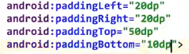
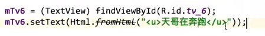
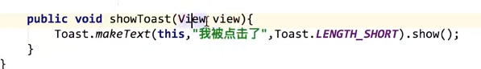
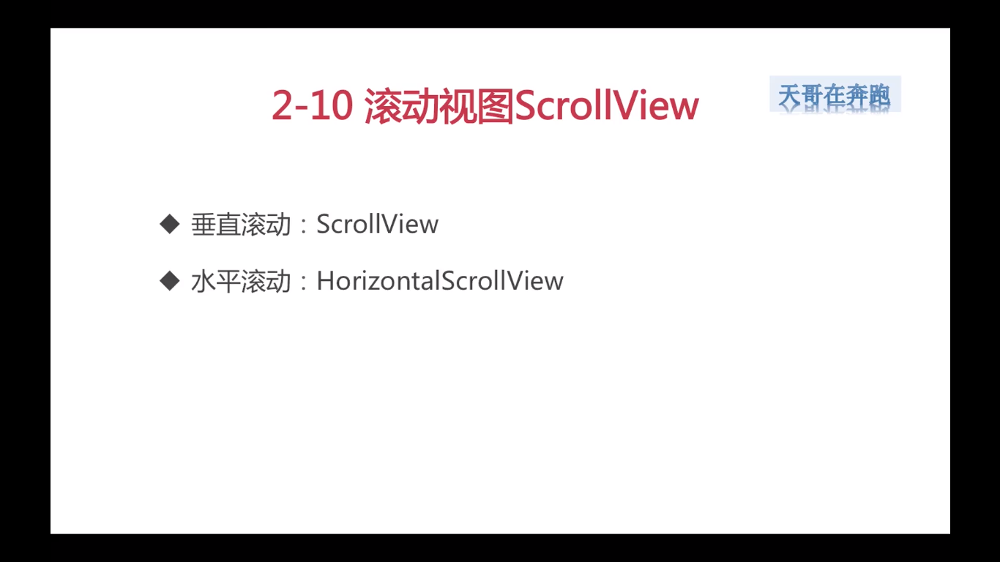
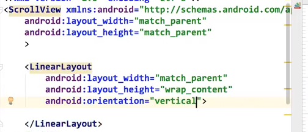
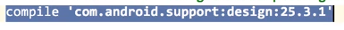

[TOC]

# Andriod学习

## 前置

### 一、常用辅助网站

#### 1、RGB拾色器网站

​	福步：https://link.fobshanghai.com/rgbcolor.htm

#### 2、图标网站

​	阿里巴巴免费的icon网站iconfont：https://www.iconfont.cn/

#### 3、视频源码网址

​	github：https://github.com/taifus/Android_Learning

## 第一章  文件内容

### 一、后端（Java）

#### 1、主文件

路径：app/src/main/java/(具体的包)/MainActivity

重要生命周期方法onCreate通过setContentView方法声明了布局即Activity_main

### 二、前端（页面）

#### 1、主布局

路径：app/src/main/res/layout/activity_main.xml

### 三、资源文件

#### 1、drawable

路径：app/src/main/res/drawable

内容：图片和自定义的xml文件

#### 2、mipmap

路径：app/src/main/res/mipmap-hdpi、app/src/main/res/mipmap-mdpi、app/src/main/res/mipmap-xhdpi、app/src/main/res/mipmap-xxhdpi、app/src/main/res/mipmap-xxxhdpi

内容：logo

#### 3、values

路径：app/src/main/res/values

内容：颜色（colors）、文字（strings）、样式（styles）

### 四、配置文件

#### 1、AndroidMainfest.xml

路径：app/src/main/AndroidMainfest.xml

内容：应用中所有用到的activitys都需要在这个文件中声明

将Mainactivity设置为启动的activity

#### 2、build.gradle

路径：app/src/build.gradle

内容：android{···

​							compileSdkVersion 编译sdk的版本

​							buildToolsVersion编译工具的版本

​							defaultConfig{  ···

​														versionCode版本号

​														versionName版本名称

​													}

​							}

​			dependencies{···

​							compile ‘xxx’ 使用到的包

​							}

## 第二章  布局

### 一、线性布局LinearLayout

#### 1、常用属性

##### 1.1  android:id

​	线性控件的标志，用来寻找这个控件

​	@+id创建一个id

##### 1.2  andriod:layout_width

​	线性控件的宽度，单位使用dp，不用px（适配不同机型）

​	wrap_content  包含内容，内容有多少，宽度就为多少

​	match_parent  匹配父控件，父控件有多少，宽度就为多少

##### 1.3  andriod:layout_height

​	线性控件的高度，单位使用dp（字体使用sp）不用px（适配不同机型）

​	wrap_content  包含内容，内容有多少，宽度就为多少

​	match_parent  匹配父控件，父控件有多少，宽度就为多少

##### 1.4  andriod:background

​	线性控件的背景，颜色、图片和自定义的xml文件

​	#000000  黑色	//fobshanghai.com/rgbcolor.htm取色

##### 1.5  andriod:layout_margin

​	线性控件的外边距，单位使用dp（字体使用sp）不用px（适配不同机型）

##### 1.6  andriod:layout_padding

​	线性控件的内边距，单位使用dp（字体使用sp）不用px（适配不同机型）

##### 1.7  andriod:orientation

​	线性控件的方向，默认为水平

​	vertical  垂直方向

​	horizontal  水平方向

##### 1.8  andriod:gravity

​	对齐方式（内部元素排列方式）

​	bootm  底部对齐

​	right  右部对齐

​	left  左部对齐

​	top  上部对齐

​	center  居中对齐

​	center_horizontal  水平居中

​	center_vertical  垂直居中

##### 1.9  andriod:layout_weight

​	减掉父控件被占用的空间后剩余部分根据权重划分

#### 2、View

**所有控件的父类**

### 二、相对布局RelativeLayout

#### 1、最常用属性

##### 1.1  android:layout_toLeftOf

​	在某个控件的左边

##### 1.2  android:layout_toRightOf

​	在某个控件的右边

##### 1.3  android:layout_alignBootom

​	跟某个控件底部对齐

##### 1.4  android:layout_alignParentBootom

​	跟父控件底部对齐

##### 1.5  android:layout_below

​	在某个控件的下边

### 三、文字布局TextView

#### 1、最常用属性

##### 1.1  文字大小、颜色

​	文字内容：android:text  //可以引用字符串，也可以直接写文字

​	文字显示为大写：android:textAllCaps="true"  //默认为true

​	文字颜色：android:textColor

​	文字大小：android:textSize  //字体大小使用sp

##### 1.2  显示不下使用...

​	文字行数：android:maxLines

​	使用...：android:ellipsize="end"

##### 1.3  文字+icon

​	图片放在drawable文件夹下

##### 1.4  中划线、下划线

​	中划线

![image-20210103

​	下划线

​	//通过html设置下划线

##### 1.5  跑马灯

​	文字行数：android:singlLine=“true”

​	使用跑马灯：android:ellipsize="marquee"

​	跑马灯重复次数：android:marqueeRepeatLimit=“marquee_forever”  //一直重复，也可以写成-1

​	获取焦点：android:focusable=“true”

​	焦点被触及：android:focusableInTouchMode=“true”

#### 2、Button

​	为TextView的子类

##### 2.1  最主要属性

##### 2.2  在activity文件中声明button

​	

##### 2.3  在activity文件中找到button

​	findViewById返回值为View，需要强制类型转换为子类Button

##### 2.4  在activity文件中设置button点击事件

##### 2.5  新建一个activity

​	在AndroidMainfest.xml中声明activity，‘.’代表包名

##### 2.6  跳转到新创建的activity

##### 2.7  添加背景，使button显示为圆角

##### 2.8  添加背景，使button显示描边

##### 2.9  添加背景，是button出现按压效果

##### 2.9  设置点击事件

1、android:onClick=“showToast”

​	在activity中设置函数showToast

2、直接在activity中设置点击事件

#### 3、EditText

​	TextView的子类

##### 3.1  主要属性

​	提示：android:hint  //默认提示

​	密码不显示：android:inputType="testPassword"

​	数字：android:inputType="number"

##### 3.2  用户名输入框

##### 3.3  密码输入框

##### 3.4  登录按钮

##### 3.5  点击事件

##### 3.6  监听输入文字改变事件

​	addTextChangedListener函数的参数TextWacher包含三个方法，分别是文字改变前，文字改变时和文字改变后

#### 4、RadioButton

##### 4.1  实现button选择跳转

##### 4.2  实现单选

​	在RadioGroup中放置RadioButton，默认选中android:checked=“true”，设置checked属性必须给每个RadioButton一个id属性

##### 4.3  更换样式

​	去掉圆圈，使用android:button="@null"

​	更换背景，根据state_checked设置不同的样式，选中填充，未选中描边

##### 4.4  监听事件

​	监听选中事件，在onCheckedChanged函数中编写选中后执行的内容

#### 5、CheckBox

##### 5.1  实现多选

##### 5.2  自定义选择框

##### 5.3  监听事件

### 四、ImageView

#### 1、主要属性

​	src  图片属性

​	scaleType  缩放类型 fitXY撑满控件

#### 2、加载网络图片

​	第三方库**glide**

​	具体使用

​	申请网络权限  AndroidMainfest.xml

### 五、ListView

##### 1、创建ListViewActivity

#### 2、添加展示页面

#### 3、创建Adapter类

#### 4、展示列表

​	getCount返回值为列表的数量

#### 5、构造布局

#### 6、构造静态类保存布局控件

#### 7、getView函数中设置列表块内容

#### 8、ListViewActivity类中获取展示内容

#### 9、设置网格线

#### 10、点击事件和长点击事件

### 六、GridView

#### 1、主要属性

​	**numColumns** 行数

​	**horizontalSpacing**  行之间的间距

​	**verticalSpacing**  列之间的间距

#### 2、设置展示内容

#### 3、点击事件和长点击事件

### 七、滚动视图ScrollView

#### 1、属性

​	子视图只能有一个，可以在需要滚动的视图外加一个ScrollView

#### 2、水平滚动

### 八、RecyclerView

#### 1、主要特点

##### 1.1  需要的库

#### 2、实现Adapter

#### 3、获取展示内容

#### 4、添加分割线

##### 4.1  添加dimen

##### 4.2  实现类

#### 5、监听点击事件

##### 5.1  可以通过回调方法实现与其他视图一样的监听方式

#### 6、水平展示

#### 7、网格展示

​	gridLayoutManager的第二个参数为分成几列

#### 8、瀑布流

​	StaggeredGridLayoutManager的第一个参数为行数或列数

​	**加载图片**

#### 9、ViewHolder

​	**重写onCreateViewHolder方法**

​	返回类型更改为所有视图类型的父类

### 九、WebView网络视图

#### 1、加载网页

##### 1.1  加载url

##### 1.2  加载html代码

##### 1.3  Native和JavaScript互相调用

#### 2、网页的前进后退

#### 3、使用WebView

##### 3.1  加载本地html

##### 3.2  加载网络url

##### 3.3  内部加载url，继续访问

##### 3.4  开始和结束函数  

##### 3.5  更改返回

##### 3.6  进度条和title

##### 3.7  执行js代码

### 十、弹出框

#### 1、Toast

### 十一、Activity

